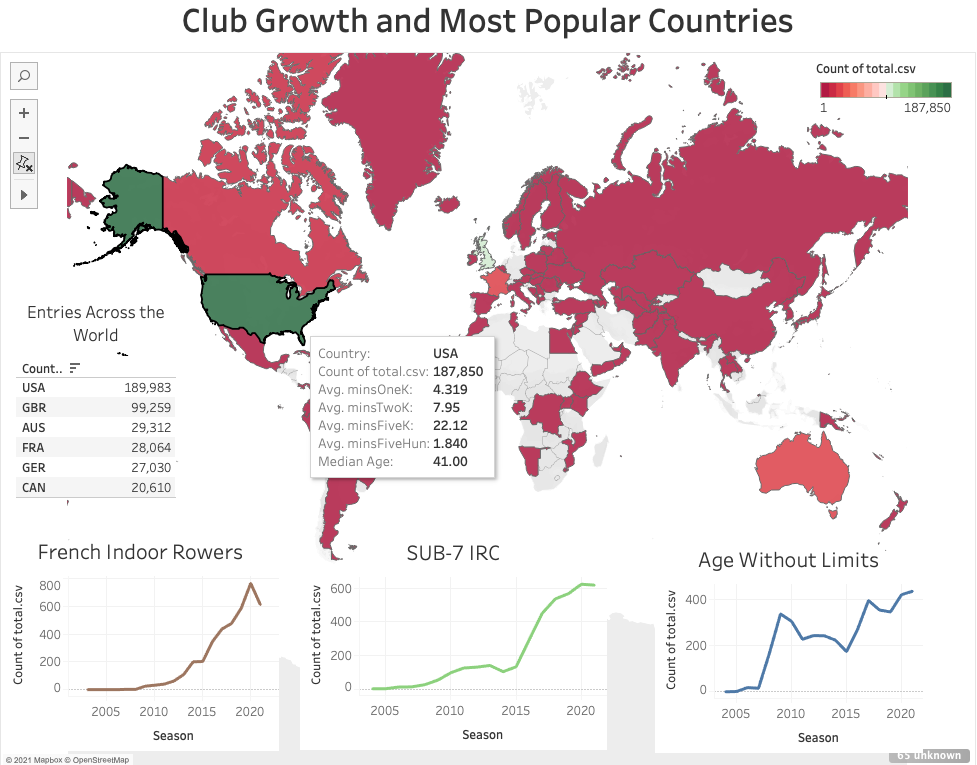

[![LinkedIn][linkedin-shield]](https://www.linkedin.com/in/john-shuford-data-analyst/)

This is the start of the most comprehensive and wide reaching fitness database ever constructed

<!-- PROJECT LOGO -->
<br />

  


<!-- TABLE OF CONTENTS -->
<details open="open">
  <summary>Table of Contents</summary>
  <ol>
    <li>
      <a href="#about-the-project">About The Project</a>
      <ul>
        <li><a href="#built-with">Built With</a></li>
      </ul>
    </li>
    <li>
      <a href="#getting-started">Getting Started</a>
      <ul>
        <li><a href="#prerequisites">Prerequisites</a></li>
        <li><a href="#installation">Installation</a></li>
      </ul>
    </li>
    <li><a href="#usage">Usage</a></li>
    <li><a href="#contact">Contact</a></li>
    <li><a href="#acknowledgements">Acknowledgements</a></li>
  </ol>
</details>


<!-- ABOUT THE PROJECT -->
## About The Project



I scraped all of the performance data from the concept 2 website. I then cleaned and normalized all of that data moved it into an SQL database then visualized everything in Tableau. Follow this [link](https://public.tableau.com/profile/john.shuford#!/vizhome/Concept2_Dashboard/ClubGrowthandPopularContries) to view and interact with the dashboard.
### Built With

This section should list any major frameworks that you built your project using. Leave any add-ons/plugins for the acknowledgements section. Here are a few examples.
* [Pandas](https://pandas.pydata.org/docs/)
* [Beautiful Soup](https://www.crummy.com/software/BeautifulSoup/bs4/doc/)
* [Matplotlib](https://matplotlib.org/stable/contents.html)
* [Tableau](https://www.tableau.com/)
* [PostgreSQL](https://www.postgresql.org/)


<!-- GETTING STARTED -->
## Getting Started

To get a local copy up and running follow these simple example steps.

### Prerequisites

This is a list of all of the packages that you need to have installed in your virtual environment for the project to run.
* pandas
* matplotlib
* splinter
* time
* bs4
* webdriver_manager


### Installation

1. Get a free API Key at [https://example.com](https://example.com)
2. Clone the repo
   ```sh
   git clone https://github.com/your_username_/Project-Name.git
   ```
3. Install NPM packages
   ```sh
   npm install
   ```
4. Enter your API in `config.js`
   ```JS
   const API_KEY = 'ENTER YOUR API';
   ```

<!-- USAGE EXAMPLES -->
## Usage
### Beautiful Soup

Here is an example of what I did when I used Beautiful Soup to scrape all of the data from the Concept 2 Website!

```sh
#The loop to scrape the C2 data
for x in (season):
    #creating the season variable for the scrape
    currenet_season = x
    
    #getting the first page of the season
    initial_url = f'{url}/{currenet_season}/rower/2000'
    
    #getting splinter to visit the site and create a soup element to parse
    browser.visit(initial_url)
    html = browser.html
    soup = bs(html, 'lxml')
    
    #finding the number of pages for for each season
    page_numbers = int(soup.select("div > ul[class=pagination] > li")[11].text)
    
    #appending the first page to the dataframe
    twoK2021 = twoK2021.append(pd.read_html(initial_url)[1], ignore_index = True)
    
    #print record to keep track of the process
    print(f'{page_numbers} pages in {currenet_season}')
    print(f'starting to progess {currenet_season}')
    
    #the loop for the later pages
    for x in range (2, page_numbers + 1):
        #creating the search url for the later pages
        search_url = f'{url}/{currenet_season}/rower/2000?page={x}'
        
        #appending the pages to the dataframe
        twoK2021 = twoK2021.append(pd.read_html(search_url)[1], ignore_index = True)
        
        #printing record to keep track
        print(f'processing {currenet_season}, {x} of {page_numbers}')

#exit out of the browser
browser.quit()
```
For more information about the power of beautiful soup follow this link! https://www.crummy.com/software/BeautifulSoup/bs4/doc/

### Pandas

Here is an example of a function that I wrote that I used when I iterated through the dataframes to clean them with Pandas

```sh
#the function to clean the for time tests
def clean_forTime (df, distance, testname):
    #adding a column with the test name
    df['Test'] = testname
    
    #drop any rows that don't have a value in time
    df = df.dropna(subset=['Time'])
    
    #apply the mintocec function to the time column
    df['Seconds'] = df['Time'].apply(mintosec)
    
    #find the split time with the C2 formula
    df['Split'] = df['Seconds'].apply(lambda x: round(500*(x/distance), 2))
    
    #find the watts with the C2 formula
    df['Watts'] = df['Split'].apply(lambda x: round(2.8/(x/500)**3,2))
    
    #sort the dataframe by watts, highest value at the top
    df.sort_values(by = ['Watts'], ascending=False)
    
    #drop any unnecessary columns
    df = df.drop(columns=['Unnamed: 0', 'Pos.', 'Type'])
    
    #drop all of the rows that do not have a verified distance
    df = df[df['Verified'] != 'No']
    
    #send the dataframe to CSV with out an index
    df.to_csv(f'../CSVs/cleaned/{testname}.csv', index = False)
    
    #return the dataframe
    return df
 ```
 For more information on the power of pandas follow this link! https://pandas.pydata.org/docs/

<!-- CONTACT -->
## Contact

John Shuford - [LinkedIn](https://www.linkedin.com/in/john-shuford-data-analyst/) - johnshuford@me.com

Project Link: [https://github.com/JohnShuford/Web-Design-Challenge](https://github.com/JohnShuford/Web-Design-Challenge)

Deployed: [https://johnshuford.github.io/Web-Design-Challenge/](https://johnshuford.github.io/Web-Design-Challenge/)

<!-- ACKNOWLEDGEMENTS -->
## Acknowledgements

* This project was for a project with realFIT, inc.


<!-- MARKDOWN LINKS & IMAGES -->
<!-- https://www.markdownguide.org/basic-syntax/#reference-style-links -->
[contributors-shield]: https://img.shields.io/github/contributors/othneildrew/Best-README-Template.svg?style=for-the-badge
[contributors-url]: https://github.com/othneildrew/Best-README-Template/graphs/contributors
[forks-shield]: https://img.shields.io/github/forks/othneildrew/Best-README-Template.svg?style=for-the-badge
[forks-url]: https://github.com/othneildrew/Best-README-Template/network/members
[stars-shield]: https://img.shields.io/github/stars/othneildrew/Best-README-Template.svg?style=for-the-badge
[stars-url]: https://github.com/othneildrew/Best-README-Template/stargazers
[issues-shield]: https://img.shields.io/github/issues/othneildrew/Best-README-Template.svg?style=for-the-badge
[issues-url]: https://github.com/othneildrew/Best-README-Template/issues
[license-shield]: https://img.shields.io/github/license/othneildrew/Best-README-Template.svg?style=for-the-badge
[license-url]: https://github.com/othneildrew/Best-README-Template/blob/master/LICENSE.txt
[linkedin-shield]: https://img.shields.io/badge/-LinkedIn-black.svg?style=for-the-badge&logo=linkedin&colorB=555
[linkedin-url]: https://linkedin.com/in/othneildrew
[product-screenshot]: images/screenshot.png
